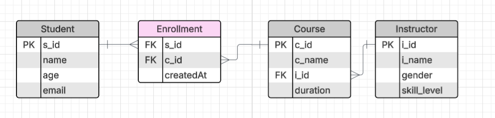

# Database-Normalization-Postgres-Installation-and-Application-Insight

Case Study File Link: https://lily-plate-b6a.notion.site/Case-Study-082bcd700e034e0b85a54bf82ba590ab?pvs=4

# Case Study

A Medical Database System is needed to enhance the efficiency and effectiveness of healthcare services. This system will be able to seamlessly integrates the information of patients, doctors, appointments, medical records, and medical facilities.

**Entities:**

1. **Patients:**
   - Attributes: PatientID (Primary Key), FirstName, LastName, DateOfBirth, Gender, ContactNumber, Email
2. **Doctors:**
   - Attributes: DoctorID (Primary Key), FirstName, LastName, Specialization, ContactNumber, Email
3. **Appointments:**
   - Attributes: AppointmentID (Primary Key), PatientID (Foreign Key), DoctorID (Foreign Key), AppointmentDate, AppointmentTime, Status
4. **Medical Records:**
   - Attributes: RecordID (Primary Key), AppointmentID (Foreign Key), Diagnosis, Prescription, TestResults, createdAt
5. **Medical Facilities:**
   - Attributes: FacilityID (Primary Key), FacilityName, Location, ContactNumber

**Relationships:**

- Patients can have multiple appointments with different doctors.
- Doctors can have multiple appointments with different patients.
- Each appointment may have a corresponding medical record, and vice versa.
- A medical facility can have multiple doctors, and a doctor can work in multiple medical facilities.
- This relationship is represented through a junction table.

## 6-1 Understanding Anomalies

- Anomalies in database refer to inconsistency or unexpected issues that can occur during data manipulation and retrieval

##### Anomalies are main three Types

1. Update anomalies
   
2. Delete anomalies
   
3. Insert Anomalies
   
   

- Data Reparation Is also one kind of anomalies
- To Avoid these anomalies we have to understand what data should be separate. Like user info will be one table branch will be in one table and address will be in one table and reference the data to required table.
  
- Here comes the Normalization Concept.

##### What is Normalization?

- Makes database structure nice and if there is any anomalies and redundancies these are step by step removed.

- User Info are separated and branch info are separated and the branch id (primary key) is placed inside the user information as foreign key.

## 6-2 Understanding the Functional Dependencies

#### Normalization in-depth and normalization Properties

- Normalization is a technique by using which we can remove the anomalies in the tables we can remove step by step.
- To understand the normalization we have to understand two topics
  1. Functional Dependencies
  2. Normal Forms

#### Functional Dependencies

- Functional Dependency in simple term means that the value of one attribute (or set of attributes) uniquely determines the value of another attribute(S) in a database.

- According to the table if we know the value of x then we can determine y.

- In This case as x value 2 is duplicate so it can give any value among the two. In This case there will be no functional dependency.

- In this case as being duplicate but the values are same we can say this has functional dependency.

##### To determine the dependency we have a formula

x-->y

###### Formula

- If duplication exists then we will use this formula
  for t1.x = t2.x
  then t1.y = t2.y
- Its telling 2 value of x if the corresponding values of 2 y is same then we can say its functionally dependent.

- This is not a functional dependent table.

- This is a Functional Dependent table if we consider EmployeeID and EmployeeName.
- If we Consider EmployeeName and Department its not functionally dependent.

## 6-3 Normalization and 1st Normal Forms(1NF)

#### What is Normal Forms?

- A series of guidelines that help to ensure that the design of a database is efficient, organized and free from data anomalies

- There are different types of normal forms. 0NF,1NF,2NF,3NF

#### 1NF

- There are some rules to determine that if a table is 1NF or not
  1. **Atomic values :** In this table 1st course is not atomic since there are two values
  2. **Unique Column Names :** This table do not has Unique column names.
  3. **Positional Dependency Of Data :** There will be no positional dependency. if we change the row position the data meaning must be same.
  4. **Same Data Type :** Columns Should Contain data that are the same type.
  5. **Determine Primary Key :** one key should be made primary key and that should be unique
- All the rules are satisfied for the table except 2 and 1.
- To convert this into 1NF we have to remove the duplicate column and make the courses atomic by splitting the courses into individual course.

- converted to 1NF but there is one problem like data redundancy came in title. These will be fixed in next normal forms.
- Another problem is we are now not able to determine primary key since some have became duplicate. We can handle this merging serial_no & Courses to make unique primary key. as two keys are taken to make primary key they are called composite primary key.

## 6-4 2nd Normal Forms and Partial Dependencies

- There are some rules to determine that if a table is 2NF or not

  1. It must satisfy the rules of 1st normal form.
  2. Must not contain any non-prime/non-key attribute that is functionally dependent on a proper subset of any candidate key of the relation.

- since we know by using the key we can find a row uniquely non-key do not works here. so the non-prime/non-key the keys by which we can not find out the row uniquely.

- In this table there is no individual key that we can select as primary key. rather bwe can combine two attribute(StudentID, CourseID) to identify a row uniquely (this is called composite primary key). Other two attributes (courseName,Instructor) are non-prime/non-key attributes. here non-prime keys must be dependent on the composite primary key entirely and can not be partially dependent.
- If wer have composite primary key and any part of it has functional dependency with the non-key/non-primes, then its not a 2NF. like if you just take CourseID from the composite primary key and can define CourseName or Instructor then its not a 2NF.
- This tables CourseID and CourseName is functionally dependent which reflect partial functional dependency. and do not follow 2NF and will be a problem.

- To Normalize the table and make it follow 2NF we can split the table

- while doing it we have lost the ability that which student is doing which course since we have lost StudentID. this is called **lossy decomposition**. and we do not want to do this as this is a bad practice.

- so we introduce another table and got back the ability. we have to do it like this. and this reflects the all info of previous table and there is no partial dependency. and this is now **Lossless Decomposition**. and this is converted to 2NF
- 2NF steps are followed to handle the complexity of **Many to Many** Relationship.

## 6-5 3rd Normal Forms and Transitive Dependency

- There are some rules to determine that if a table is 3NF or not

  1. Must be in 2NF
  2. Must not contain transitive dependency

- suppose x-->y and y-->z that means x can determine y and y can determine z then x can also determine z, x-->z this is transitive dependency. and these type of dependency can not exist in 3NF.

- In This table the primary key will be stud_id since its unique.
- As stud_id column is unique it has functional dependency.
- Here stud_id and state is functionally dependent state and country is also functionally dependant.
- So here we can determine country using stud_id through state. this is transitive dependency.
- state,country are non key attributes. Here an non key can determine another non-key so this is transitive dependency.

- 3rd Normal Form says there will be no transitive dependency. we can normalize the situation by splitting the table.

- still there is problem. so data needs to be connected.
  
- still there is reparation. normalization can never remove the repetition completely it minimizes the reparation.

## 6-6 Resolving Many to Many With Junction Table.

- We have a many to many relationship problem. If many to many situation comes 4th step will be added. otherwise anomalies will be here.

- One or many Student can take many courses ans well many Many student can take one course or many. This is many to many relationship.

- These tables are not good. since c_ids and s_ids are containing multi values because of many to many relation. As we know we have to keep atomic.

- we have to resolve the many to many situation.

- we can organize the table like these but the problem is data duplication i mean redundancy is coming. Data redundancy is the main devil. If there is redundancy ther anomalies will come as well.
- In the tables partial dependency is also coming. suppose we have make a composite primary id combining s_id & c_id. here s_id and name is partially dependent since if we know the id we can tell the name. here 2NF rules violated.

- we can think like this but here some anomalies may come since there are a lot of null values. this is not also good. If course increases if any course is added by any one else. and the person has taken the only last course will get null values up to the course he has taken.

- the red marks attributes are the problem

- to solve this we can take help of bridge table

- we are taking two foreign key and making a junction table or intermediate table. and the purpose of it is making and maintaining relationship between student and the course.
- Student (one to many)--> junction table <-- (one to may)Course. Direct many to many relationship is disappeared.

- here we have decomposed the tables with 0 data loss and the Junction table here will have composite primary key by combining s_id,c_id.

## 6-7 Completing ER Diagram

## 6-8 What is Postgres And Installing Postgres.

- Its Worlds Most Advanced Open Source Relational Database Management System.
- We can make our computer a database server installing software.
- We can Communicate using SQL

#### Why we will use Postgres

1. Its open source
2. RDBMS
3. Modern (supports modern data type, Supports modern features like MVCC)
4. ACID Compliance
5. Advanced Data Types
6. Saleability
7. Indexing
8. Community Support

https://www.enterprisedb.com/downloads/postgres-postgresql-downloads

## 6-9 Exploring Data Flow On an Application And Exploring PSQL

- In Present days client server architecture is maintained.
- There is client and server and the the client server communication happens to ren the server.
- Suppose we haver a user and he goes to a web page and wants to see a information and clicks a button and the the request goes to a backend through a specific address. we have to tell which port we will be using.
- Server will check if there it have to take and give and take data to database.
- If its required that we have to get a data the server will request to our DBMS(Postgres) and connect. While connecting we have to tell host and port.
- we have to give some user credentials to access the database then we will get the database access.
- If everything is right and the connection is stabled and then DBMS will check from which database the data is coming since we can make multiple database in our postgres.
- DBMS will match that the user has access of the database or not. if has access
- Server to database connection is done normally using driver to reduce deep level works. driver gives us simple api and we work. as like we use mongoose to connect.
- The drivers are like prisma, type orm drizzel orm in server to connect with database.

#### After Installing Postgre

- This is a postgres shell by using this we will connect with postgres server and run commands to create, delete, update database, create table and so on.
- Normally we will use graphic user interface but we need to see it if we work remotely we have to use this terminal.

- press enter since we want to run in localhost
- Database using postgres by default
- and port is by default Port : 5432
- Username [postgres] . postgres gives us a default user name.
- password : during installation what we have gave

- now we are in postgres server.

#### Popular commands for postgres

`select version();` - this will give us the version

`\l` - This will show the available database list in our pc

- here postgres is main database and templates are given.
- suppose we want to change the main database to main

`\c template0` - this will connect the template0 database

- To see if the database has any table or not we have to write

`\d` - will show all the tables available with all sequence and views

- tables are called relation

`create table test_table(name varchar(50));` - this will create a table in our database

`\dn` - this will show the schema in our table.

`\! cls` - this will clear the cmd

`\d+` - this will show some extra things of the table

`\dt` - this will show the tables with now view and sequence just simple table and relations

`\conninfo` - this will show the connection info.

`\q` - this will quit the shell

- we can create database, schema, user, role and privileged role we can create.
